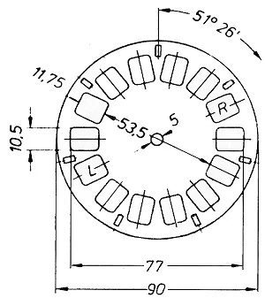

# Viewmaster 3D Disks
Hoping that it's possible to create view master disks using a python program based on a set of measurements. 

Here's a sample of the viewmaster wheel.

All Known Sizes:
- 90mm              - Total Width
- 77mm              - Edge to edge on photos
- 65.25mm           - Image Center to Imange Center
- 11.75mm x 10.5mm  - Image size
- 3mm x 2mm         - Notch (Need to Confirm)
- 5mm               - Disk Center Hole
- 7                 - Total image pairs
- 51.428571429      - Degreess rotation for each image pasting.
